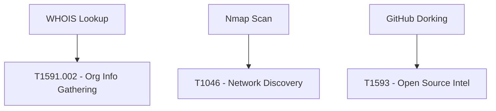

# ReCon - Comprehensive Project Analysis

## Project Structure
```bash
ReCon/
├── main.py                # CLI Entry Point
├── config.py              # Configuration Management
├── requirements.txt       # Dependency Specifications
├── Modules/               # Reconnaissance Modules
│   ├── dns_info.py        # DNS Enumeration
│   ├── github_dorking.py  # GitHub Intelligence
│   ├── nmap_scanner.py    # Network Scanning
│   └── whois_lookup.py    # Domain Registration Analysis
├── utils/                 # Support Utilities
│   ├── logger.py          # Logging System
│   └── reporter.py        # Report Generation
└── reports/               # Output Directory
```

## Core Components Breakdown

### 1. Configuration Management (config.py)
```python
# API Credentials
SHODAN_API_KEY = "YOUR_API_KEY"  # Shodan search integration
GITHUB_TOKEN = "YOUR_TOKEN"      # GitHub API access

# System Settings
LOG_LEVEL = "INFO"               # Debug | Info | Warning | Error
REPORT_DIR = "reports"           # Output directory
```

### 2. CLI Orchestration (main.py)
**Key Functions:**
```python
def main():
    # Argument parsing
    parser = argparse.ArgumentParser()
    parser.add_argument("target", help="Domain/IP to investigate")
    parser.add_argument("-m", "--modules", nargs='+', 
                       choices=['whois','dns','nmap','github','shodan'],
                       default=['all'])
    
    # Module execution
    available_modules = {
        'whois': WhoisLookup(),
        'dns': DNSInformation(),
        'nmap': NmapScanner(),
        'github': GitHubDorking(),
        'shodan': ShodanQuery()
    }
    
    # Report generation
    generate_overall_report(results, args.format)
```

### 3. Module Architecture

#### 3.1 WHOIS Lookup Module
```python
class WhoisLookup:
    def run(self, target):
        """Retrieves domain registration details"""
        whois_data = whois.whois(target)
        return {
            'registrar': whois_data.registrar,
            'creation_date': str(whois_data.creation_date),
            'name_servers': whois_data.name_servers
        }
```

#### 3.2 Nmap Scanner Module
```python
class NmapScanner:
    def run(self, target):
        """Executes network port scan"""
        self.scanner.scan(target, arguments='-sS -T4')
        return {
            'open_ports': self.scanner[target]['tcp'].items(),
            'os_info': self.scanner[target]['osmatch'][0]
        }
```

### 4. Reporting System (utils/reporter.py)
**Report Generation Flow:**
```python
def generate_html_report(data):
    return f'''
    <html>
        <body>
            <h1>Recon Report</h1>
            <pre>{json.dumps(data, indent=4)}</pre>
        </body>
    </html>'''
    
def save_report(data, filename):
    with open(f"reports/{filename}", "w") as f:
        f.write(generate_html_report(data))
```

### 5. Security Implementation

#### MITRE ATT&CK Mapping


#### Security Controls
- API key encryption in config
- Scan rate limiting
- Legal disclaimer in reports
- Error sanitization in logs

## Execution Example
```bash
python main.py example.com -m whois dns nmap -f html
```
1. Gathers domain registration info
2. Enumerates DNS records
3. Conducts port scan
4. Generates HTML report

## Recommendations
1. Implement asynchronous scanning
2. Add cloud storage integration
3. Develop plugin architecture
4. Include vulnerability database checks
